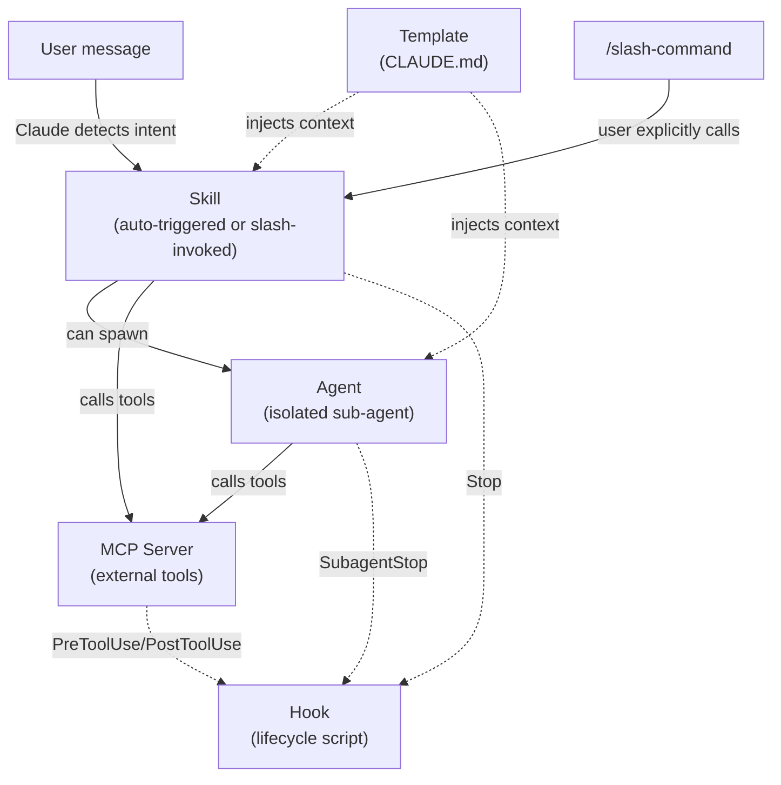

# Contributing to the Agentic Plugins Marketplace

Thank you for contributing! This guide covers how to add new plugins, what files each plugin needs, and how the review process works.

---

## Table of contents

- [Local development setup](#local-development-setup)
- [Before you start](#before-you-start)
- [Plugin types overview](#plugin-types-overview)
- [How plugin types work together](#how-plugin-types-work-together)
- [Creating plugins with Claude](#creating-plugins-with-claude)
- [General rules](#general-rules)
  - [Repository layout](#repository-layout)
- [Adding an MCP server](#adding-an-mcp-server)
- [Adding a skill](#adding-a-skill)
- [Skills vs slash commands](#skills-vs-slash-commands)
- [Adding an agent](#adding-an-agent)
- [Adding a hook](#adding-a-hook)
- [Adding a template](#adding-a-template)
- [Updating the marketplace catalog](#updating-the-marketplace-catalog)
- [Testing your plugin](#testing-your-plugin)
- [Security — porting from external sources](#security--porting-from-external-sources)
- [Submitting a pull request](#submitting-a-pull-request)
- [Code of conduct](#code-of-conduct)

---

## Local development setup

When building or testing a plugin you want Claude Code to load from your local clone rather than from the published GitHub repo. Register the marketplace as a local directory source so changes take effect immediately on `/reload-plugins` — no push or publish step required.

This repo ships a `.claude/settings.local.example.json` with the required config. Copy it and set your local path:

```bash
cp .claude/settings.local.example.json .claude/settings.local.json
```

Then edit `.claude/settings.local.json` and replace the placeholder with the absolute path to your clone:

```jsonc
{
  "extraKnownMarketplaces": {
    "agentic-plugins-marketplace": {
      "source": {
        "source": "directory",
        "path": "/absolute/path/to/your/clone"   // ← replace this
      }
    }
  }
}
```

`settings.local.json` is gitignored — it is safe to add personal permissions or machine-specific paths there without affecting teammates.

Then enable the plugin you are working on. Add to `.claude/settings.json` (or your `settings.local.json`):

```jsonc
{
  "enabledPlugins": {
    "my-new-plugin@agentic-plugins-marketplace": true
  }
}
```

Run `/reload-plugins` inside Claude Code to pick up changes. You do not need to install the plugin — enabling it from a directory source loads the files directly from disk.

> **Scope tip** — use project scope (`.claude/settings.json`) while developing so your test config is isolated to the clone directory and does not affect other projects.

---

## Before you start

- Check `.claude-plugin/marketplace.json` and `plugins/` to make sure a similar plugin doesn't already exist.
- Open an issue first if you're unsure whether a plugin fits or want feedback on the idea.
- If you are porting a plugin from an external source, read the [security guidance below](#security-porting-from-external-sources) before proceeding.

---

## Plugin types overview

| Type | Directory | Purpose |
|------|-----------|---------|
| MCP Server | `plugins/mcp-servers/` | Expose external APIs and services as Claude tools |
| Skill | `plugins/skills/` | Prompts that give Claude a structured playbook — auto-triggered or slash-invoked |
| Agent | `plugins/agents/` | Specialised sub-agents that Claude can spawn to handle focused tasks |
| Hook | `plugins/hooks/` | Shell scripts triggered by Claude Code lifecycle events |
| Template | `plugins/templates/` | `CLAUDE.md` starter files for specific project stacks |

Plugins are installed exclusively through Claude Code's native `/plugin` system. There is no separate bash installer.

**Commands are not a separate plugin type.** A slash command (`commands/<name>.md`) is a delivery mechanism that any plugin can include alongside its primary content — templates ship one to copy `CLAUDE.md` into place, skills can ship one as an explicit override. The `plugins/skills/` directory is the right home for any plugin whose primary purpose is giving Claude a task playbook, regardless of whether it auto-triggers, exposes a slash command, or both. See [Skills vs slash commands](#skills-vs-slash-commands) for when to use each.

---

## How plugin types work together

Plugins are not siloed — they interact at runtime. Understanding the relationships helps you design plugins that compose well and document their dependencies accurately.

### Runtime relationships



Solid arrows = active invocation. Dashed arrows = passive / event-driven.

| Relationship | How it works |
|---|---|
| **Template → Skill/Command/Agent** | CLAUDE.md is loaded into every conversation. It shapes how Claude interprets requests and which skills/agents it reaches for. |
| **Skill/Command → MCP** | Any MCP server installed in the user's session exposes its tools globally. Skills and commands call those tools directly by name. |
| **Skill/Command → Agent** | A skill or command can explicitly spawn an agent (`Agent` tool) or Claude will auto-select one when the agent's `description` matches the context. |
| **Agent → MCP** | Agents run in an isolated context but inherit the same MCP tool set unless the agent's `tools` field restricts access. |
| **Hook → MCP events** | `PreToolUse` and `PostToolUse` hooks fire before and after every MCP tool call. The hook receives the tool name, input, and (for PostToolUse) the response. |
| **Hook → Stop/SubagentStop** | `Stop` fires when the main Claude turn ends; `SubagentStop` fires when any spawned agent finishes. |

### Cross-plugin dependencies

There is no formal `dependencies: []` field in `plugin.json`. Inter-plugin dependencies are handled in two ways:

**1. Document the dependency in README.md**

```markdown
## Prerequisites

- Install `postgres@agentic-plugins-marketplace` — this plugin calls the
  `query` tool it exposes.
```

**2. Reference tools and agents by name in the plugin body**

Skills, commands, and agents can reference MCP tools and other agents by name. If the dependency is not installed, Claude will note the tool is unavailable.

```markdown
<!-- Inside SKILL.md or an agent system prompt -->

Use the `query` tool to run: SELECT id, title FROM issues WHERE status = 'open'
```

```markdown
<!-- Spawning a specific agent from a skill -->

Use the Agent tool to run the `migration-safety-checker` agent
and pass it the contents of the migration file.
```

**3. Reference skills from CLAUDE.md (template)**

A template can tell Claude which skills to prefer:

```markdown
<!-- Inside a template's CLAUDE.md -->

When the user asks to commit staged changes, use the `conventional-commit`
skill to generate the message.
```

### Composing multiple plugin types in one feature

A common pattern is to pair an **MCP server** with a **skill** and an **agent** so they share responsibility cleanly:

```
MCP server    — knows how to talk to the API (tools: search, create, update)
Skill         — decides when to act and orchestrates the high-level workflow
Agent         — handles a focused sub-task (e.g., formatting the output)
Hook          — logs every API call for audit purposes
```

Each plugin type is independently installable — a user who only wants the MCP server gets it without the skill. Document which combinations are recommended in the README.

---

## Creating plugins with Claude

The fastest way to build a plugin is to let Claude write it for you using the official creation tools from the Claude plugin marketplace. Install the relevant plugin, then describe what you want — Claude will generate the boilerplate, write the content, and validate the output.

| You want to create | Recommended tool | Install |
|--------------------|-----------------|---------|
| A skill | [Skill Creator](https://claude.com/plugins/skill-creator) | `/plugin install skill-creator@claude-plugins-official` |
| An agent | [Plugin Developer Toolkit](https://claude.com/plugins/plugin-dev) | `/plugin install plugin-dev@claude-plugins-official` |
| An MCP server | [MCP Server Dev](https://claude.com/plugins/mcp-server-dev) | `/plugin install mcp-server-dev@claude-plugins-official` |
| A hook | [Hookify](https://claude.com/plugins/hookify) | `/plugin install hookify@claude-plugins-official` |
| Any plugin type | [Plugin Developer Toolkit](https://claude.com/plugins/plugin-dev) | `/plugin install plugin-dev@claude-plugins-official` |

Once installed, just describe what you want in natural language:

```
Create a skill that summarises the key changes in a PR as a bullet list
```

```
Add an agent that reviews database migrations for safety issues
```

```
Build an MCP server that wraps the OpenWeatherMap API
```

The **Plugin Developer Toolkit** (`plugin-dev`) is a good starting point if you are unsure which type fits — it covers all five plugin types via dedicated sub-skills (`skill-development`, `agent-development`, `mcp-integration`, `hook-development`, `command-development`).

For templates, use the built-in `/init` command to generate a `CLAUDE.md` file for the target stack, then wrap it in the template plugin structure described below.

---

## General rules

Every plugin lives in its own directory under the relevant type folder.

**Required in every plugin:**

```
plugins/<type>/<name>/
├── .claude-plugin/
│   └── plugin.json    ← plugin metadata
└── README.md          ← user-facing documentation
```

**Additional type-specific files** are described in each section below.

### Naming

- Directory name: lowercase kebab-case (e.g. `my-new-plugin`)
- Be specific — `postgres` is better than `database`
- Must be unique across the marketplace

### .claude-plugin/plugin.json

Minimum required fields:

```jsonc
{
  "name": "my-plugin",        // kebab-case, matches directory name
  "version": "1.0.0",         // semver, start at 1.0.0
  "description": "One sentence describing what this plugin does.",
  "author": "your-github-handle",
  "license": "MIT",
  "keywords": ["tag1", "tag2"]
}
```

### README.md

Every README must cover:

1. **What it does** — one-sentence description
2. **Prerequisites** — anything the user must install beforehand
3. **Installation** — the `/plugin install <name>@agentic-plugins-marketplace` command
4. **Configuration** — all required env vars or settings with examples
5. **Usage example** — at least one concrete example

### Repository layout

```
agentic-plugins-marketplace/
├── .claude-plugin/
│   └── marketplace.json          ← /plugin marketplace catalog
├── plugins/
│   ├── mcp-servers/
│   │   └── <name>/
│   │       ├── .claude-plugin/
│   │       │   └── plugin.json   ← metadata + userConfig for required env vars
│   │       ├── .mcp.json         ← MCP server config
│   │       └── README.md
│   ├── skills/
│   │   └── <name>/
│   │       ├── .claude-plugin/
│   │       │   └── plugin.json
│   │       ├── skills/
│   │       │   └── <trigger>/
│   │       │       └── SKILL.md  ← auto-triggered prompt
│   │       ├── commands/
│   │       │   └── <name>.md     ← optional slash command
│   │       └── README.md
│   ├── agents/
│   │   └── <name>/
│   │       ├── .claude-plugin/
│   │       │   └── plugin.json
│   │       ├── agents/
│   │       │   └── <agent>.md    ← agent definition with YAML frontmatter
│   │       └── README.md
│   ├── hooks/
│   │   └── <name>/
│   │       ├── .claude-plugin/
│   │       │   └── plugin.json
│   │       ├── hooks/
│   │       │   └── hooks.json
│   │       ├── hook.sh
│   │       └── README.md
│   └── templates/
│       └── <name>/
│           ├── .claude-plugin/
│           │   └── plugin.json
│           ├── commands/
│           │   └── use-<name>-template.md ← slash command to copy CLAUDE.md
│           ├── CLAUDE.md
│           └── README.md
├── CATALOG.md                    ← available plugins + official recommendations
├── CONTRIBUTING.md
└── README.md
```

---

## Adding an MCP server

### Directory structure

```
plugins/mcp-servers/<name>/
├── .claude-plugin/
│   └── plugin.json   ← include userConfig for every required env var
├── .mcp.json         ← MCP server config read by /plugin
└── README.md
```

### .mcp.json

```jsonc
{
  "<server-name>": {
    "command": "npx",
    "args": ["-y", "@scope/mcp-server-package"],
    "env": {
      "API_KEY": "${API_KEY}"   // ${VAR} = resolved from the user's environment
    }
  }
}
```

> **Note**: Plugin `.mcp.json` files use the server name as the top-level key. This is different from native MCP config in `settings.json`, which uses a `mcpServers` wrapper.

### userConfig in .claude-plugin/plugin.json

Declare every `${VAR}` placeholder so the `/plugin` TUI can prompt the user and store secrets in the OS keychain:

```jsonc
{
  "name": "my-server",
  "userConfig": {
    "API_KEY": {
      "type": "string",           // "string" | "number" | "boolean" | "directory" | "file"
      "title": "API key",         // label shown in the TUI prompt
      "description": "API key for the service (found at example.com/settings)",
      "required": true
    }
  }
}
```

### Checklist

- [ ] `.mcp.json` present with correct server command and args
- [ ] `.claude-plugin/plugin.json` has `userConfig` for every `${VAR}` placeholder
- [ ] README lists all tools the server exposes
- [ ] `.claude-plugin/marketplace.json` entry added
- [ ] No secrets or hardcoded credentials anywhere

---

## Adding a skill

### Directory structure

```
plugins/skills/<name>/
├── .claude-plugin/
│   └── plugin.json
├── skills/
│   └── <trigger>/
│       └── SKILL.md    ← the prompt template
└── README.md
```

### Writing SKILL.md

Skills are **auto-triggered** — Claude detects from the `description` field in the YAML frontmatter when to invoke the skill, rather than the user typing a slash command. Every `SKILL.md` must start with YAML frontmatter:

```yaml
---
name: review
description: Use when the user asks to review the current branch, check code quality, or run a code review.
---
```

- `name` — identifier for the skill (must be unique across installed skills)
- `description` — the trigger signal Claude uses to decide when to invoke this skill; be specific about user intent patterns

Write the body as instructions to a capable engineer:

- Use imperative mood ("Analyse the diff and…", "Generate a…")
- Be explicit about the steps Claude should follow
- Specify the expected output format
- One skill, one job — keep it focused
- Never include secrets or credentials

> **Skills vs commands**: if you want a user-invoked slash command rather than auto-triggered behaviour, create a `commands/<name>.md` file instead.

> **Tip**: use the [Skill Creator](https://claude.com/plugins/skill-creator) plugin to generate, evaluate, and A/B benchmark skills from a description.

### Checklist

- [ ] `skills/<trigger>/SKILL.md` present with YAML frontmatter (`name` + `description`)
- [ ] Trigger name doesn't clash with an existing skill
- [ ] `.claude-plugin/plugin.json` present
- [ ] README shows the trigger and a concrete example
- [ ] `.claude-plugin/marketplace.json` entry added

---

## Skills vs slash commands

A plugin can expose behaviour in two ways: an **auto-triggered skill** (`skills/<name>/SKILL.md`) or a **slash command** (`commands/<name>.md`). They share the same YAML frontmatter structure but differ in when and how they fire.

### How each works

| | Auto-trigger (Skill) | Slash command |
|---|---|---|
| **How it fires** | Claude detects intent from the conversation | User types `/<name>` explicitly |
| **File location** | `skills/<trigger>/SKILL.md` | `commands/<name>.md` |
| **Frontmatter `name`** | Registered as a skill identifier | Becomes the slash command name |
| **Takes arguments** | No | Yes — available as `$ARGUMENTS` |
| **User awareness** | None needed | User must know the command exists |
| **Predictability** | Depends on description quality | Always fires exactly when called |
| **Scope** | Fires across all conversations | Only fires when explicitly invoked |

### When to use each

**Use an auto-triggered skill when:**
- You want "whenever the user asks to do X, Claude should do Y" — always on, no friction
- The intent is recognisable from natural language (e.g., "review my code", "explain this codebase")
- The action has no irreversible side effects that would surprise the user

**Use a slash command when:**
- The action is destructive or slow and the user should consciously choose to run it (e.g., copying a file, running a batch operation)
- You need the user to pass an argument (`/deploy staging`)
- The behaviour is infrequent enough that auto-triggering would be noise
- You want a reliable override — slash commands fire even when auto-trigger would be suppressed

**Use both** when a feature benefits from seamless detection *and* an explicit override. The auto-trigger handles the common path; the slash command gives power users a reliable entry point.

### Creating an auto-triggered skill

```
plugins/skills/<name>/
├── skills/
│   └── <trigger>/
│       └── SKILL.md
```

```yaml
---
name: my-skill
description: Use when the user asks to [intent patterns].
---

[Instructions for Claude...]
```

The `description` field is the sole trigger mechanism — Claude reads it before every turn and decides whether the skill applies. Write it as an if-clause: "Use when the user asks to…". Be specific: a vague description triggers too broadly; a description that's too narrow never fires.

### Creating a slash command

```
plugins/skills/<name>/          # or plugins/templates/<name>/
├── commands/
│   └── <command-name>.md
```

```yaml
---
description: Short description shown in the /help list
argument-hint: Optional hint displayed in the UI (e.g. "branch name")
allowed-tools: ["Read", "Write", "Bash"]   # optional — defaults to all tools
---

The user invoked this with arguments: $ARGUMENTS

[Instructions for Claude...]
```

The command is invoked as `/<command-name>` or `/<plugin>:<command-name>` if namespaced. `$ARGUMENTS` is replaced with whatever the user typed after the command name.

> Commands can live inside any plugin type directory — skills, templates, and agents can all ship commands alongside their primary content.

---

## Adding an agent

Agents are specialised sub-agents that Claude can spawn to handle a focused task. Unlike skills (which run in the main Claude context), agents run in an isolated context with their own system prompt, model choice, and tool access.

> **Tip**: use the `agent-development` skill from the [Plugin Developer Toolkit](https://claude.com/plugins/plugin-dev) to generate agents from a description. Install it with `/plugin install plugin-dev@claude-plugins-official`, then say "create an agent that…".

### Directory structure

```
plugins/agents/<name>/
├── .claude-plugin/
│   └── plugin.json
├── agents/
│   └── <agent-name>.md    ← agent definition
└── README.md
```

A plugin can bundle multiple agents in the `agents/` directory.

### Writing agents/<agent-name>.md

Every agent file must start with YAML frontmatter followed by the agent's system prompt:

```yaml
---
name: my-agent
description: |
  Use this agent when the user asks to [describe trigger conditions].

  <example>
  Context: User wants to [task]
  user: "[Example user message]"
  assistant: "I'll use the my-agent agent to [what it does]."
  </example>
model: inherit           # "inherit" | "sonnet" | "haiku" | "opus"
color: blue              # blue | cyan | green | yellow | red | magenta
tools: ["Read", "Bash"]  # optional: omit to give the agent full tool access
---

You are [expert persona]. Your job is to [core purpose].

[Full system prompt...]
```

**Frontmatter fields:**

| Field | Required | Description |
|-------|----------|-------------|
| `name` | Yes | Lowercase kebab-case identifier (3–50 chars) |
| `description` | Yes | Trigger conditions + 2–4 `<example>` blocks showing when Claude should invoke the agent |
| `model` | No | Model to use; `inherit` (default) uses whatever model the user has selected |
| `color` | No | Visual indicator in Claude Code's UI |
| `tools` | No | Restrict tool access; omit for full access |

**Choosing a color:**

| Color | Good for |
|-------|---------|
| `blue` / `cyan` | Analysis, review |
| `green` | Generation, creation |
| `yellow` | Validation, caution |
| `red` | Security, critical operations |
| `magenta` | Transformation, creative tasks |

**Writing the system prompt:**

- Establish a clear expert persona ("You are a senior security engineer…")
- List core responsibilities as a numbered list
- Provide a step-by-step process
- Define the expected output format
- Handle edge cases explicitly
- Keep it focused — one agent, one job

### Checklist

- [ ] `agents/<agent-name>.md` present with valid YAML frontmatter
- [ ] `description` contains 2–4 `<example>` blocks
- [ ] Agent name is unique across installed agents
- [ ] Model and tool choices follow least-privilege
- [ ] `.claude-plugin/plugin.json` present
- [ ] README describes what each agent does and when it triggers
- [ ] `.claude-plugin/marketplace.json` entry added

---

## Adding a hook

### Directory structure

```
plugins/hooks/<name>/
├── .claude-plugin/
│   └── plugin.json
├── hooks/
│   └── hooks.json      ← native hook config
├── hook.sh             ← the hook script
└── README.md
```

### hooks/hooks.json

```jsonc
{
  "description": "One sentence describing what this hook does.",
  "hooks": {
    "Stop": [                       // lifecycle event (see table below)
      {
        "hooks": [
          {
            "type": "command",
            "command": "${CLAUDE_PLUGIN_ROOT}/hook.sh"
          }
        ]
      }
    ]
  }
}
```

Use `${CLAUDE_PLUGIN_ROOT}` for the script path — it resolves to the installed plugin directory.

### Lifecycle events

| Event | Fires when | Can block tool calls? |
|-------|-----------|----------------------|
| `PreToolUse` | Before any tool call | Yes (non-zero exit blocks) |
| `PostToolUse` | After any tool call | No |
| `Notification` | Claude surfaces a notification | No |
| `Stop` | Claude finishes its turn | No |
| `SubagentStop` | A subagent finishes | No |

### Writing hook.sh

- Start with `#!/usr/bin/env bash` and `set -euo pipefail`
- Read the JSON payload from stdin (`PAYLOAD="$(cat)"`) — hooks receive input via stdin, not environment variables
- Use `jq` to extract fields: `tool_name`, `session_id`, `tool_input`, `tool_response`, `stop_reason`
- Keep the script idempotent — it runs many times per session
- Use `${CLAUDE_PLUGIN_ROOT}` for paths to bundled files
- Avoid blocking I/O in `PreToolUse` hooks

> **Tip**: use [Hookify](https://claude.com/plugins/hookify) to generate hooks from plain-English descriptions without writing JSON config files.

### Checklist

- [ ] `hook.sh` starts with `set -euo pipefail` and reads input from stdin
- [ ] `hooks/hooks.json` uses `${CLAUDE_PLUGIN_ROOT}/hook.sh`
- [ ] Script is idempotent
- [ ] `.claude-plugin/plugin.json` present
- [ ] README documents env variables read and required system tools
- [ ] `.claude-plugin/marketplace.json` entry added

---

## Adding a template

Templates are `CLAUDE.md` files for specific project stacks. Claude Code reads `CLAUDE.md` automatically at the start of every session to understand the project's conventions.

### Directory structure

```
plugins/templates/<name>/
├── .claude-plugin/
│   └── plugin.json
├── commands/
│   └── use-<name>-template.md  ← slash command that copies CLAUDE.md to the project
├── CLAUDE.md                   ← the template content
└── README.md
```

Claude Code reads `CLAUDE.md` from the **project root**, not from inside the installed plugin directory. Templates must therefore ship a command that copies the file into place. The command reads `${CLAUDE_PLUGIN_ROOT}/CLAUDE.md` and writes it to the user's working directory.

> **Tip**: use the built-in `/init` command to generate a `CLAUDE.md` starter for the target stack, then wrap it in this template structure.

### Writing CLAUDE.md

A good template covers:

| Section | Content |
|---------|---------|
| Overview | Placeholder (`<!-- fill in -->`) for the project description |
| Tech stack | Language version, package manager, test runner, linter |
| Project structure | Annotated two-level directory tree |
| Development commands | Copy-pasteable commands Claude can run |
| Conventions | Naming, style, patterns specific to this stack |
| Testing guidelines | Unit vs integration boundary |
| What Claude should NOT do | Guardrails to prevent common mistakes |

Use `<!-- comment -->` to mark sections the user must fill in after installation.

### Checklist

- [ ] Placeholder comments mark every section requiring user input
- [ ] "What Claude should NOT do" section present
- [ ] All commands are correct for the stated toolchain
- [ ] `commands/use-<name>-template.md` present and copies `${CLAUDE_PLUGIN_ROOT}/CLAUDE.md` to the project root
- [ ] `.claude-plugin/plugin.json` present
- [ ] README explains what to customise after installation and shows the slash command to use
- [ ] `.claude-plugin/marketplace.json` entry added

---

## Updating the marketplace catalog

After adding or modifying a plugin, add or update its entry in `.claude-plugin/marketplace.json`:

```jsonc
{
  "name": "<name>",
  "source": "./plugins/<type>/<name>",
  "description": "<same as plugin.json description>",
  "version": "1.0.0",
  "category": "<mcp-server | skill | agent | hook | template>",
  "tags": ["tag1", "tag2"]
}
```

Keep entries sorted: `mcp-server` → `skill` → `agent` → `hook` → `template`, alphabetically within each group.

---

## Testing your plugin

Run through this checklist before opening a PR.

```bash
# Verify all plugins load cleanly (run in terminal)
claude plugin list

# Inside Claude Code — reload and confirm no errors on the summary line
/reload-plugins
# Expected: "Reloaded: N plugins · N skills · N agents · N hooks · N plugin MCP servers"

# For hooks — confirm the script parses stdin JSON without errors
echo '{"tool_name":"Bash","session_id":"test","tool_input":{"command":"ls"}}' \
  | bash plugins/hooks/<name>/hook.sh

# For MCP servers — verify tools are registered
/mcp
```

### Expected clean state

| Check | Expected |
|-------|---------|
| `claude plugin list` | All enabled plugins listed, no load errors |
| `/reload-plugins` | No errors on the summary line |
| `/doctor` | "Claude Code diagnostics dismissed" |
| Hook stdin test | Script exits 0; output produced correctly |
| Agent in reload | Agent count in summary line includes new agent |

---

## Security — porting from external sources

> **Warning: never copy a plugin from an external source without a full security review.**

When you port a plugin from outside this organisation — a public GitHub repo, a blog post, a third-party marketplace — you are potentially introducing code that runs with elevated privilege inside every installer's Claude session. The review bar must be higher than for plugins written from scratch, because you cannot know the original author's intent.

### What to audit before submitting

**MCP servers**

- Read the server's source code in full, or verify it comes from a reputable publisher (e.g., an official `@modelcontextprotocol/server-*` package, or a package owned by the service provider itself).
- Check what the server does with tool responses. A malicious server can embed instructions in response text that hijack Claude's subsequent behaviour — **prompt injection via tool output**. Look for anything that constructs response strings from external data without sanitisation.
- Confirm the server does not phone home, write files outside its declared scope, or request more permissions than it needs.
- Pin to a specific version or commit hash in `.mcp.json` rather than a floating `latest`.

**Skills and agents**

- Read `SKILL.md` and each `agents/*.md` in full, including any HTML comments (`<!-- -->`), Unicode whitespace, or zero-width characters that could conceal instructions.
- A skill or agent file from an untrusted source can contain hidden prompt-injection payloads that override Claude's behaviour when invoked. Treat these files with the same scrutiny as executable code.

**Hooks**

- Hook scripts run as shell commands with your full user privileges — **no sandboxing**. A single malicious line can exfiltrate credentials, install persistence, or destroy data.
- Read every line of `hook.sh`. Do not trust scripts that use `eval`, pipe from the internet, or obfuscate logic with base64 / here-docs.
- Run the script in a throwaway environment first if you have any doubt.

### Porting checklist

- [ ] Source repository identified and linked in the PR description
- [ ] Server source code reviewed (MCP servers) or skill/agent file read in full
- [ ] No obfuscated code, unexpected network calls, or excessive filesystem access
- [ ] Version pinned to a specific release, not `latest`
- [ ] PR description explains what the plugin does and why it is safe to include

---

## Submitting a pull request

1. Fork the repo and create a branch: `git checkout -b feat/plugin-<name>`
2. Add the plugin directory with all required files
3. Add the entry to `.claude-plugin/marketplace.json`
4. Open a PR against `main` with the title `feat: add <name> <type>`

### PR checklist

- [ ] Plugin directory contains `.claude-plugin/plugin.json` and `README.md`
- [ ] Type-specific file present: `.mcp.json` / `skills/<trigger>/SKILL.md` / `agents/<name>.md` / `hooks/hooks.json`
- [ ] `userConfig` declared for every required env var (MCP servers)
- [ ] `.claude-plugin/marketplace.json` updated
- [ ] No secrets or credentials anywhere in the plugin directory
- [ ] README covers prerequisites, installation, configuration, and a usage example
- [ ] [Testing checklist](#testing-your-plugin) passes with no errors

---

## Code of conduct

Be kind. Review feedback constructively. Assume good intent.

If you experience or witness unacceptable behaviour, open an issue or contact the maintainers directly.
