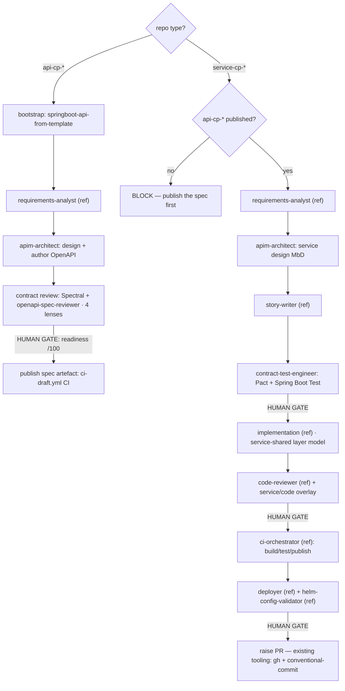

# Design: `hmcts-apim-orchestrator` — API-Marketplace SDLC plugin

- **Date:** 2026-06-04
- **Status:** Proposed (design approved in brainstorming; build not started)
- **Author:** srivani.muddineni (with Claude Code)
- **Location:** new plugin at `plugins/agents/hmcts-apim-orchestrator/`
- **Related:** AMP-428 (`openapi-spec-reviewer` — already built in `apim-claude-template`, migrated here)

---

## 1. Goal

Create a **standalone marketplace plugin**, `hmcts-apim-orchestrator`, that drives the
**API-Marketplace SDLC** (OpenAPI-first `api-cp-*` spec libraries + `service-cp-*` Spring Boot
services). It consolidates API-Marketplace Claude tooling by:

- **referencing** the delivery-model-agnostic agents in the CPP-owned `hmcts-sdlc-orchestrator`
  (never modifying it),
- **migrating** the genuinely API-Marketplace-unique assets out of `apim-claude-template`, and
- **building** only the two agents that are genuinely missing.

`apim-claude-template` is **decommissioned** once repos are re-pointed.

## 2. The three sources and how each is reused

| Source | Owner | Reuse mode |
|---|---|---|
| `agentic-plugins-marketplace` | marketplace | **Host** the new plugin; reference standalone skills by co-install |
| `hmcts-sdlc-orchestrator` (`plugins/agents/…`) | CPP team (other) | **Reference, never modify** — invoke agnostic agents by `subagent_type` |
| `apim-claude-template` | this team | **Migrate then decommission** |

## 3. Reuse matrix (evidence-based)

Built from a full read of all 15 `hmcts-sdlc-orchestrator` agents, its hooks/context/skills,
and the standalone marketplace skills. Headline: **~72% reuse-as-is, ~19% adapt, ~9% drop.**

### 3.1 Agents

| Agent | Verdict | Reason |
|---|---|---|
| `requirements-analyst` | **REUSE (ref)** | Delivery-model-agnostic requirements taxonomy |
| `story-writer` | **REUSE (ref)** | Universal story/AC format |
| `implementation` | **REUSE (ref)** | TDD discipline is universal; stack specifics come from context |
| `code-reviewer` | **REUSE (ref) + overlay** | Generic review; add OpenAPI/service overlay |
| `ci-orchestrator` | **REUSE (ref)** | Build/test/scan/publish stages identical |
| `deployer` | **REUSE (ref)** | Flux/Helm rollout generic (service path only) |
| `helm-config-validator` | **REUSE (ref)** | Infra-agnostic |
| `architecture-designer` | **ADAPT → `apim-architect`** | CQRS-vs-MbD rubric, RAML refs unusable as-is |
| `test-engineer` | **ADAPT → `contract-test-engineer`** | CQRS test pyramid, Serenity/UI, viewstore tests must go |
| `doc-generator` | **ADAPT (optional)** | Reads Maven/CQRS modules; needs Gradle/OpenAPI variant |
| `research` | **DROP / replace** | Designed for CQRS event-flow tracing; replace with `api-dependency-analyzer` (optional) |
| `event-flow-mapper` | **DROP** | Zero domain events in API Marketplace |
| `rbac-auditor` | **DROP** | Drools-specific; APIM uses Spring Security |
| `migration-reviewer` | **DROP** | Liquibase-specific; `service-cp-*` uses Flyway (future `flyway-validator` if needed) |

### 3.2 Hooks, context, skills

| Item | Verdict |
|---|---|
| Guard hooks (`block-pii`, `block-secrets`, `guard-bash`, `guard-paths`) | **COPY** — universal, can't be referenced cross-plugin |
| CPP context docs (`hmcts-standards`, `coding`, `logging`, `azure-*`, `tech-stack`) | **NOT copied** — they travel with the referenced agents when invoked |
| Standalone marketplace skills (`adr-template`, `bdd-workflow`, `review-checklist`, `conventional-commit`, `code-review`, `explain-codebase`) | **REFERENCE** by co-install |
| `accessibility-check` | **DROP** — no UI in API/spec scope |

### 3.3 Migrated from `apim-claude-template`

| Asset | Becomes | Note |
|---|---|---|
| `templates/api-spec-shared.md` | `context/api-spec-shared.md` | The `api-cp-*` substitute for CQRS context docs |
| `templates/service-shared.md` | `context/service-shared.md` | Full `service-cp-*` layer model + toggle rules |
| `templates/shared-code-rules.md` | `context/shared-code-rules.md` | Team-wide code rules |
| `templates/claude-md-standards.md` | `context/claude-md-standards.md` | `/init` authoring standards |
| `skills/openapi-spec-reviewer/` | `skills/openapi-spec-reviewer/` | AMP-428 — rebase knowledge paths to plugin-local |
| `skills/create-pr/` | **NOT migrated** | Use existing PR tooling (`gh` + marketplace `conventional-commit` / `code-review` skills) |
| `skills/release/` | **NOT migrated** | Release workflow out of scope |
| `skills/wire-claude-context/` | **RETIRED** | `@import` mechanism superseded; `/init` role folds into `claude-md-standards.md` |

## 4. Net-new build (the only real work)

1. **`apim-architect`** *(adapt `architecture-designer`)* — OpenAPI-first / Modern-by-Default
   design rubric (no CQRS), authors the spec per `api-spec-shared.md`, hands to
   `openapi-spec-reviewer`.
2. **`contract-test-engineer`** *(adapt `test-engineer`)* — Pact consumer-driven contracts +
   Spring Boot Test + WireMock/TestContainers; no Serenity/UI/viewstore.
3. *(Phase 6, optional)* **`api-dependency-analyzer`** — which `service-cp-*` consume which
   `api-cp-*` spec versions; breaking-change detection.

## 5. Target structure

```
plugins/agents/hmcts-apim-orchestrator/
├── .claude-plugin/plugin.json
├── CLAUDE.md                       ← NEW: dual-path API-first pipeline + gates
├── README.md
├── agents/
│   ├── apim-architect.md           ← NEW (adapt architecture-designer)
│   ├── contract-test-engineer.md   ← NEW (adapt test-engineer)
│   └── api-dependency-analyzer.md  ← NEW, phase 6 (optional)
├── skills/
│   └── openapi-spec-reviewer/      ← MIGRATED (AMP-428 + 4 knowledge files)
├── context/
│   ├── api-spec-shared.md          ← MIGRATED
│   ├── service-shared.md           ← MIGRATED
│   ├── shared-code-rules.md        ← MIGRATED
│   └── claude-md-standards.md      ← MIGRATED
└── hooks/                          ← COPIED (4 guard scripts + hooks.json)

references (co-install, not copied):
  ▶ hmcts-sdlc-orchestrator:{requirements-analyst, story-writer, implementation,
    code-reviewer, ci-orchestrator, deployer, helm-config-validator}
  ▶ marketplace skills:{adr-template, bdd-workflow, review-checklist,
    conventional-commit, code-review, explain-codebase}   ← PR raised via these + `gh`
```

## 6. Pipeline (contract-first dual path)

`CLAUDE.md` auto-detects repo type (`api-cp-*` vs `service-cp-*`) and runs the matching path.
**Contract-first is enforced: a `service-cp-*` build cannot start until its `api-cp-*` artefact
is published.**



| Path | Stages |
|---|---|
| `api-cp-*` | bootstrap → requirements *(ref)* → **apim-architect** → **contract review [gate]** → publish *(auto)* |
| `service-cp-*` | requirements *(ref)* → apim-architect → stories *(ref)* → **contract-test-engineer [gate]** → implementation *(ref, auto)* → code review *(ref, [gate])* → CI *(ref, auto)* → deploy *(ref, [gate])* → raise PR *(existing tooling)* |

## 7. Requirements

**Functional**

- **FR1** Standalone marketplace plugin driving the dual-path API-first SDLC with human gates.
- **FR2** Reuse `hmcts-sdlc-orchestrator` agnostic agents by reference; never modify it.
- **FR3** Migrate `apim-claude-template`'s 4 templates (→`context/`) and **1 skill** (`openapi-spec-reviewer` →`skills/`); retire `wire-claude-context`. **Do not** migrate `create-pr`/`release` — PRs use existing tooling (`gh` + `conventional-commit`/`code-review`); release is out of scope.
- **FR4** New agents `apim-architect` + `contract-test-engineer`; OpenAPI-first, Pact-based, zero CQRS.
- **FR5** Stage-3 contract review wired to `openapi-spec-reviewer` (4 lenses) + Spectral; gate on readiness score.
- **FR6** Enforce contract-first (no service build before a published spec).
- **FR7** Decommission `apim-claude-template` once repos are re-pointed.

**Non-functional**

- **NFR1** No duplication of agents/context already in sibling plugins (reference, don't copy).
- **NFR2** Self-sufficient guard hooks (PII/secrets/bash/paths).
- **NFR3** Graceful degradation if `hmcts-sdlc-orchestrator` is not co-installed (fall back to inline prompts).
- **NFR4** Keep the APIM lightweight philosophy — thin agents leaning on context, not a heavy agent farm.
- **NFR5** Accessibility/WCAG out of scope (no UI).

## 8. Plan (phased)

| Phase | Work |
|---|---|
| **P0 Foundation** | Scaffold plugin (`plugin.json`, `README`, `CLAUDE.md` skeleton); copy guard hooks; register in `marketplace.json` + `CATALOG.md` |
| **P1 Migrate APIM assets** | 4 templates → `context/`; migrate `openapi-spec-reviewer` → `skills/` (rebase knowledge paths to plugin-local); no `create-pr`/`release` migration |
| **P2 Net-new agents** | Author `apim-architect` + `contract-test-engineer` (adapt from CPP originals; strip CQRS) |
| **P3 Pipeline wiring** | Write dual-path `CLAUDE.md`: gates, `subagent_type` references, fallbacks, contract-first guard |
| **P4 Validate** | End-to-end on a real `api-cp-*` + `service-cp-*` pair (clean spec + deliberately violating spec) |
| **P5 Decommission** | Re-point repos off `apim-claude-template`; archive it; update READMEs/CATALOG |
| **P6 (optional)** | `api-dependency-analyzer` |

## 9. Risks & trade-offs

1. **Cross-plugin reference coupling** — pipeline needs `hmcts-sdlc-orchestrator` installed.
   *Mitigation:* document the dependency; degrade to inline prompts (NFR3).
2. **Referenced CPP agents may drift / carry CQRS phrasing** — reference only the genuinely
   generic ones; keep the list short; APIM-specific stages run from migrated context.
3. **Decommissioning `apim-claude-template`** breaks repos still using `@import` paths.
   *Mitigation:* P5 re-points every repo before archiving; communicate the cut-over.
4. **Over-engineering** — keep agents thin and context-driven, true to the APIM philosophy.
5. **AMP-428 already delivered** — migrate `openapi-spec-reviewer`, don't rebuild it.

## 10. Open questions

- Is `api-dependency-analyzer` in-scope for v1 or deferred to P6? (Default: deferred.)
- Confirm the exact referenced-agent set is acceptable to the CPP team (no modification, only
  invocation).