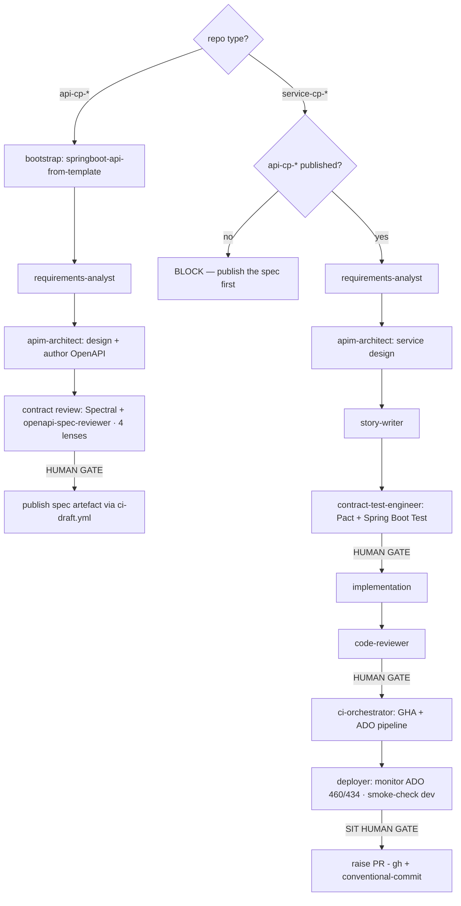

# Design: `hmcts-apim-sdlc-orchestrator` — API-Marketplace SDLC plugin

- **Date:** 2026-06-04 (updated 2026-06-09)
- **Status:** Implemented
- **Author:** srivani.muddineni (with Claude Code)
- **Location:** `plugins/agents/hmcts-apim-sdlc-orchestrator/`
- **Related:** AMP-428 (`openapi-spec-reviewer` — already built in `apim-claude-template`, migrated here)

---

## 1. Goal

Create a **fully self-contained** standalone marketplace plugin, `hmcts-apim-sdlc-orchestrator`,
that drives the **API-Marketplace SDLC** (OpenAPI-first `api-cp-*` spec libraries +
`service-cp-*` Spring Boot services). It consolidates all API-Marketplace Claude tooling by:

- **building** all pipeline agents natively (no dependency on `hmcts-sdlc-orchestrator`),
- **migrating** the API-Marketplace-unique assets out of `apim-claude-template`, and
- **decommissioning** `apim-claude-template` once repos are re-pointed.

> **Design decision (revised):** The original design planned to reference
> `hmcts-sdlc-orchestrator` agents by `subagent_type`. This was reversed — the CPP/CQRS
> orchestrator targets a different stack (WildFly, Jenkins, SonarQube, Snyk, Drools) and its
> agents carry incompatible guidance. All pipeline agents are now owned natively by this plugin.
> Do **not** use `hmcts-sdlc-orchestrator` agents for `api-cp-*`/`service-cp-*` work.

`apim-claude-template` is **decommissioned** once repos are re-pointed.

---

## 2. Sources

| Source | Owner | Reuse mode |
|---|---|---|
| `agentic-plugins-marketplace` | marketplace | **Host** the plugin |
| `apim-claude-template` | this team | **Migrate then decommission** |
| `hmcts-sdlc-orchestrator` | CPP team | **Not referenced** — different stack (CQRS/WildFly/Jenkins) |

---

## 3. What was built

### 3.1 Agents (all owned by this plugin)

| Agent | Origin | Purpose |
|---|---|---|
| `apim-architect` | New | OpenAPI-first design; authors spec per `api-spec-shared.md`; hands to `openapi-spec-reviewer` |
| `contract-test-engineer` | New | Pact + Spring Boot Test + WireMock/TestContainers; no Serenity/UI/CQRS content |
| `requirements-analyst` | New (APIM-specific) | Path A vs Path B detection; no accessibility NFRs; blocks service work until spec published |
| `story-writer` | New (APIM-specific) | Stories reference specific OpenAPI endpoints; DoD: PMD, CodeQL; no SonarQube/Snyk |
| `implementation` | New (APIM-specific) | Mapper-first order; generated interface compliance; CJSCPPUID; Jakarta EE; T1–T5 toggle rules |
| `code-reviewer` | New (APIM-specific) | 11-category checklist: generated interface, layer model, toggle rules, security, idempotency, PMD |
| `ci-orchestrator` | New (APIM-specific) | GHA + ADO hybrid; PMD not SonarQube; CodeQL+DAST; exact workflow file knowledge |
| `deployer` | New (APIM-specific) | Monitors ADO 460/434; smoke-checks; SIT via GitHub Release; does not trigger deployments |

**Dropped from original scope (not applicable to APIM stack):**
- `helm-config-validator` — not yet needed
- `research` / `event-flow-mapper` — no domain events in API Marketplace
- `rbac-auditor` → future `authentication-auditor` (TBD, pending authZ/authN design)
- `migration-reviewer` — Liquibase-specific; API Marketplace uses Flyway (future `flyway-validator` if needed)

### 3.2 Context files

| File | Load timing | Purpose |
|---|---|---|
| `shared-code-rules.md` | Always | Team-wide code rules and naming conventions |
| `hmcts-standards.md` | Always | Security classification, Coding in the Open, Conventional Commits, PR hygiene, data protection, test pyramid |
| `api-spec-shared.md` | `api-cp-*` repos | OpenAPI generation pipeline, spec standards, CI/CD for spec libs |
| `service-shared.md` | `service-cp-*` repos | Layer model, feature toggle rules T1–T5, CI/CD (GHA+ADO), deploy pipeline |
| `claude-md-standards.md` | On demand (`/init`) | Standards for generating repo `CLAUDE.md` |
| `logging-standards.md` | On demand | JSON logging mandate, MDC fields, "never log" list |
| `azure-sdk-guide.md` | On demand | DefaultAzureCredential, Service Bus idempotency, Key Vault, observability, Kubernetes hygiene |

### 3.3 Hooks

| Hook | Event | Purpose |
|---|---|---|
| `bootstrap-context.sh` | `SessionStart` | Auto-creates `.claude/CLAUDE.md` in `api-cp-*`/`service-cp-*` repos; idempotent |
| `block-pii` | `UserPromptSubmit` | Blocks prompts containing PII/case data |
| `block-secrets` | `PreToolUse` | Blocks writes containing secrets/tokens |
| `guard-bash` | `PreToolUse` | Guards destructive bash commands |
| `guard-paths` | `PreToolUse` | Prevents writes to protected paths |

### 3.4 Skills

| Skill | Purpose |
|---|---|
| `openapi-spec-reviewer` | Migrated from `apim-claude-template`; 4 lenses; scored /100 |
| `bootstrap-context` | Manual trigger; also runs automatically via `SessionStart` hook |

### 3.5 Migrated from `apim-claude-template`

| Asset | Destination |
|---|---|
| `templates/api-spec-shared.md` | `context/api-spec-shared.md` |
| `templates/service-shared.md` | `context/service-shared.md` (CI/CD section fully rewritten for GHA+ADO) |
| `templates/shared-code-rules.md` | `context/shared-code-rules.md` |
| `templates/claude-md-standards.md` | `context/claude-md-standards.md` |
| `skills/openapi-spec-reviewer/` | `skills/openapi-spec-reviewer/` |
| `skills/wire-claude-context/` | **Retired** — superseded by `SessionStart` hook automation |
| `skills/create-pr/` | **Not migrated** — use `gh` + `conventional-commit` marketplace skill |
| `skills/release/` | **Not migrated** — out of scope |

---

## 4. Actual structure

```
plugins/agents/hmcts-apim-sdlc-orchestrator/
├── .claude-plugin/plugin.json
├── CLAUDE.md                         dual-path API-first pipeline + gates
├── README.md
├── agents/
│   ├── apim-architect.md
│   ├── contract-test-engineer.md
│   ├── requirements-analyst.md
│   ├── story-writer.md
│   ├── implementation.md
│   ├── code-reviewer.md
│   ├── ci-orchestrator.md
│   └── deployer.md
├── skills/
│   ├── openapi-spec-reviewer/        migrated from apim-claude-template
│   └── bootstrap-context/            new; also runs automatically on SessionStart
├── context/
│   ├── api-spec-shared.md
│   ├── service-shared.md
│   ├── shared-code-rules.md
│   ├── hmcts-standards.md            new
│   ├── logging-standards.md          new (on-demand)
│   ├── azure-sdk-guide.md            new (on-demand)
│   └── claude-md-standards.md
└── hooks/
    ├── hooks.json
    ├── bootstrap-context.sh          new — SessionStart automation
    ├── block-pii.sh
    ├── block-secrets.sh
    ├── guard-bash.sh
    └── guard-paths.sh

roadmap (not yet built):
  api-dependency-analyzer.md          optional — breaking-change detection across api-cp-*
  authentication-auditor.md           future — TBD, pending authZ/authN design
```

---

## 5. Pipeline (contract-first dual path)

`CLAUDE.md` auto-detects repo type (`api-cp-*` vs `service-cp-*`) and runs the matching path.
**Contract-first is enforced: a `service-cp-*` build cannot start until its `api-cp-*` artefact
is published.**



| Path | Stages |
|---|---|
| `api-cp-*` | bootstrap → **requirements-analyst** → **apim-architect** → **contract review [gate]** → publish *(auto CI)* |
| `service-cp-*` | **requirements-analyst** → **apim-architect** → **story-writer** → **contract-test-engineer [gate]** → **implementation** *(auto)* → **code-reviewer [gate]** → **ci-orchestrator** *(auto)* → **deployer** (dev: pipeline; SIT: **[gate]**) → raise PR |

---

## 6. CI/CD pipeline (accurate)

```
push to main
  → GHA ci-draft.yml → ci-build-publish.yml
      composeUp → ./gradlew build → composeDown
      → publish JAR → GitHub Packages + Azure Artifacts
      → push Docker image → GHCR
      → trigger ADO pipeline 460 (ACR copy: GHCR → crmdvrepo01.azurecr.io)
      → ADO pipeline 434 → commits image tag to hmcts/cp-vp-aks-deploy
          env/dev branch → K8-DEV-CS01-CL02  (automatic on every merge)

GitHub Release published
  → GHA ci-released.yml → same chain
      → env/sit branch → K8-SIT-CS01-CL02  (human gate required)
```

**Scans:** PMD (`pmd/pmd-github-action@v2`, not SonarQube); CodeQL (`security-extended`) + OWASP ZAP DAST (not Snyk); gitleaks (`secrets-scanner.yml`). No Jenkins. No accessibility (no UI).

---

## 7. Requirements

**Functional**

- **FR1** Fully self-contained marketplace plugin driving the dual-path API-first SDLC with human gates; no dependency on `hmcts-sdlc-orchestrator`.
- **FR2** All pipeline agents built natively and APIM-specific (correct CI, deploy, standards).
- **FR3** Migrate `apim-claude-template`'s 4 templates → `context/` and `openapi-spec-reviewer` → `skills/`; retire `wire-claude-context`.
- **FR4** New agents `apim-architect` + `contract-test-engineer`; OpenAPI-first, Pact-based, zero CQRS.
- **FR5** Stage-3 contract review wired to `openapi-spec-reviewer` (4 lenses) + Spectral; gate on readiness score.
- **FR6** Enforce contract-first (no service build before a published spec).
- **FR7** `SessionStart` hook auto-bootstraps `.claude/CLAUDE.md` in `api-cp-*`/`service-cp-*` repos; idempotent.
- **FR8** Decommission `apim-claude-template` once repos are re-pointed.

**Non-functional**

- **NFR1** No cross-plugin runtime dependency — plugin is fully self-contained.
- **NFR2** Self-sufficient guard hooks (PII/secrets/bash/paths).
- **NFR3** Accessibility/WCAG out of scope (no UI).
- **NFR4** Keep agents thin and context-driven.

---

## 8. Delivery status

| Phase | Work | Status |
|---|---|---|
| **P0 Foundation** | Scaffold plugin; copy guard hooks; register in `marketplace.json` + `CATALOG.md` | Done |
| **P1 Migrate APIM assets** | 4 templates → `context/`; migrate `openapi-spec-reviewer` → `skills/` | Done |
| **P2 Net-new agents** | `apim-architect` + `contract-test-engineer` | Done |
| **P3 Pipeline agents** | `requirements-analyst`, `story-writer`, `implementation`, `code-reviewer`, `ci-orchestrator`, `deployer` (all APIM-specific, not referenced from CPP) | Done |
| **P3b Context expansion** | `hmcts-standards.md`, `logging-standards.md`, `azure-sdk-guide.md` | Done |
| **P3c Automation** | `SessionStart` hook (`bootstrap-context.sh`) + `bootstrap-context` skill | Done |
| **P4 Validate** | End-to-end on a real `service-cp-*` pair | In progress |
| **P5 Decommission** | Re-point repos off `apim-claude-template`; archive it | Pending |
| **P6 (optional)** | `api-dependency-analyzer` | Deferred |

---

## 9. Risks & trade-offs

1. **APIM-specific agents may drift from CPP agents over time** — mitigated by owning them
   natively; no coupling to `hmcts-sdlc-orchestrator` release cycle.
2. **Decommissioning `apim-claude-template`** breaks repos still using `@import` paths.
   *Mitigation:* P5 re-points every repo before archiving; communicate the cut-over.
3. **Over-engineering** — keep agents thin and context-driven.
4. **AMP-428 already delivered** — migrated, not rebuilt.

---

## 10. Open questions

- Is `api-dependency-analyzer` in-scope for v1 or deferred to P6? (Default: deferred.)
- `authentication-auditor` scope — pending authZ/authN design decisions.